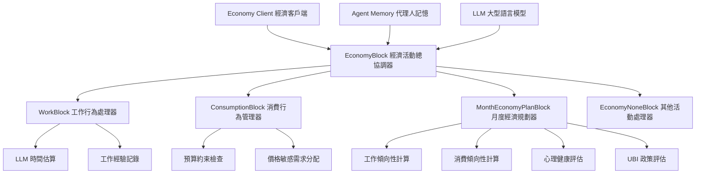

# Agent 經濟行為模組內容說明

AgentSociety 框架中的 agent 經濟行為模組是一個多層次、模組化的系統，主要包含以下核心組件：

## 1. 經濟行為核心架構

### **EconomyBlock** - 經濟活動總協調器
- **功能**：作為經濟活動的主要協調器，通過專門的子模組處理不同類型的經濟活動
- **支援的動作**：
  - `work`：支援工作行為
  - `consume`：支援消費行為
  - `economy_none`：支援其他經濟操作

**程式碼範例**：
```python
class EconomyBlock(Block):
    """協調經濟活動的主要模組，通過專門的子模組處理不同類型的經濟活動"""
    
    ParamsType = EconomyBlockParams
    OutputType = SocietyAgentBlockOutput
    ContextType = EconomyBlockContext
    NeedAgent = True
    name = "EconomyBlock"
    description = "Work, shopping, consume, and other economic activities."
    
    # 支援的經濟動作類型
    actions = {
        "work": "Support the work action",
        "consume": "Support the consume action",
        "economy_none": "Support other economic operations",
    }

    def __init__(self, toolbox: AgentToolbox, agent_memory: Memory,
                 block_params: Optional[EconomyBlockParams] = None):
        super().__init__(toolbox=toolbox, agent_memory=agent_memory,
                        block_params=block_params)
        
        # 初始化月度經濟規劃模組
        self.month_plan_block = MonthEconomyPlanBlock(
            toolbox=toolbox, agent_memory=agent_memory,
            ubi=self.params.UBI,
            num_labor_hours=self.params.num_labor_hours,
            productivity_per_labor=self.params.productivity_per_labor,
            time_diff=self.params.time_diff,
        )
        
        # 初始化各種經濟行為子模組
        self.work_block = WorkBlock(
            toolbox=toolbox, agent_memory=agent_memory,
            worktime_estimation_prompt=self.params.worktime_estimation_prompt,
        )
        self.consumption_block = ConsumptionBlock(
            toolbox=toolbox, agent_memory=agent_memory,
        )
        self.none_block = EconomyNoneBlock(
            toolbox=toolbox, agent_memory=agent_memory
        )
        
        # 設置區塊分發器
        self.dispatcher = BlockDispatcher(toolbox=toolbox, agent_memory=agent_memory)
        self.dispatcher.register_blocks([
            self.work_block, self.consumption_block, self.none_block
        ])

    async def before_forward(self):
        """在執行前運行月度規劃"""
        try:
            await self.month_plan_block.forward()
        except Exception as e:
            get_logger().warning(f"EconomyBlock MonthPlanBlock: {e}")

    async def forward(self, agent_context: DotDict) -> SocietyAgentBlockOutput:
        """協調經濟活動執行"""
        try:
            context = agent_context | self.context
            intention = context["current_step"]["intention"]
            
            # 1. 使用分發器選擇適當的處理器
            selected_block = await self.dispatcher.dispatch(context)
            if selected_block is None:
                return self.OutputType(
                    success=False,
                    evaluation=f"Failed to {intention}",
                    consumed_time=0,
                    node_id=None,
                )
            
            # 2. 委託執行給選定的子模組
            result = await selected_block.forward(context)
            return self.OutputType(**result)
            
        except Exception as e:
            get_logger().error(f"EconomyBlock: Error in forward: {e}")
            return self.OutputType(
                success=False,
                evaluation="Failed to forward",
                consumed_time=0,
                node_id=None,
            )
```

**經濟模組參數配置**：
```python
class EconomyBlockParams(BlockParams):
    """經濟模組參數配置"""
    
    worktime_estimation_prompt: str = Field(
        default=WORKTIME_ESTIMATE_PROMPT,
        description="工作時間估算提示模板"
    )
    UBI: float = Field(
        default=0,
        description="全民基本收入金額"
    )
    num_labor_hours: int = Field(
        default=168,
        description="每月勞動小時數"
    )
    productivity_per_labor: float = Field(
        default=1,
        description="每小時生產力"
    )
    time_diff: int = Field(
        default=30 * 24 * 60 * 60,
        description="兩次觸發之間的時間差（秒）"
    )
```

### **經濟客戶端連接** (`_bind_to_economy`)
- 將 agent 綁定到經濟模擬器
- 初始化經濟屬性：`currency`（貨幣）、`skill`（技能）、`consumption`（消費）、`income`（收入）

**程式碼範例**：
```python
async def _bind_to_economy(self):
    """將 agent 綁定到經濟模擬器"""
    if self.environment is None:
        raise ValueError("Environment is not initialized")
    
    # 獲取 agent 的基本經濟屬性
    person_id = await self.status.get("id")
    currency = await self.status.get("currency")
    skill = await self.status.get("work_skill", 0.0)
    consumption = 0.0
    income = 0.0
    
    # 將 agent 加入經濟系統
    await self.environment.economy_client.add_agents({
        "id": person_id,
        "currency": currency,      # 初始財富
        "skill": skill,           # 工作技能水平
        "consumption": consumption,# 當期消費
        "income": income,         # 當期收入
    })
```

## 2. 專門的經濟行為子模組

### **WorkBlock** - 工作行為處理器
- **核心功能**：
  - 工作時間估算（使用 LLM 進行智能時間預測）
  - 工作經驗記錄和追蹤
  - 工作小時統計（`work_hour_finish`）
- **工作流程**：
  1. 格式化工作情境提示
  2. 請求 LLM 進行時間估算
  3. 將工作經驗記錄到記憶系統
  4. 更新工作統計數據

**程式碼範例**：
```python
class WorkBlock(Block):
    """處理工作相關的經濟活動和時間追蹤"""
    
    name = "WorkBlock"
    description = "Handles work-related economic activities and time tracking"

    def __init__(self, toolbox: AgentToolbox, agent_memory: Memory,
                 worktime_estimation_prompt: str = WORKTIME_ESTIMATE_PROMPT):
        super().__init__(toolbox=toolbox, agent_memory=agent_memory)
        self.guidance_prompt = FormatPrompt(
            template=worktime_estimation_prompt,
            memory=agent_memory,
        )

    async def forward(self, context: DotDict):
        """處理工作任務並追蹤時間消耗"""
        # 1. 格式化工作情境提示
        await self.guidance_prompt.format(context=context)
        
        # 2. 請求 LLM 進行時間估算
        result = await self.llm.atext_request(
            self.guidance_prompt.to_dialog(),
            response_format={"type": "json_object"}
        )
        
        try:
            result_dict = json_repair.loads(clean_json_response(result))
            time = result_dict["time"]  # 預估工作時間（分鐘）
            
            # 3. 記錄工作經驗到記憶系統
            day, start_time = self.environment.get_datetime(format_time=True)
            await self.memory.status.update(
                "working_experience",
                [f"Start from {start_time}, worked {time} minutes on {context['current_step']['intention']}"],
                mode="merge",
            )
            
            # 4. 更新工作統計數據
            work_hour_finish = await self.memory.status.get("work_hour_finish")
            work_hour_finish += float(time / 60)  # 轉換為小時
            await self.memory.status.update("work_hour_finish", work_hour_finish)
            
            # 5. 記錄到經濟活動流
            node_id = await self.memory.stream.add(
                topic="economy",
                description=f"I worked {time} minutes on {context['current_step']['intention']}"
            )
            
            return {
                "success": True,
                "evaluation": f'work: {context["current_step"]["intention"]}',
                "consumed_time": time,
                "node_id": node_id,
            }
            
        except Exception as e:
            # 解析失敗時使用隨機時間
            time = random.randint(1, 3) * 60
            # ... 錯誤處理邏輯
```

**時間估算提示範例**：
```python
WORKTIME_ESTIMATE_PROMPT = """作為智能代理人的時間估算系統，請根據整體計劃和當前意圖估算完成當前行動所需的時間。

整體計劃：
${context.plan_context["plan"]}

當前行動：${context.current_step["intention"]}

當前情緒：${status.emotion_types}

範例：
- "學習程式設計": {"time": 120}
- "看電影": {"time": 150}
- "玩手機遊戲": {"time": 60}

請以 JSON 格式返回結果，時間單位為[分鐘]：
{
    "time": 10
}
"""
```

### **ConsumptionBlock** - 消費行為管理器
- **核心功能**：
  - 消費決策制定
  - 預算約束檢查
  - 價格敏感的需求分配
- **消費流程**：
  1. 檢查月度消費限制
  2. 計算基於價格權重的需求分佈（使用 softmax 函數）
  3. 通過經濟客戶端執行交易
  4. 記錄消費行為到記憶流

**程式碼範例**：
```python
class ConsumptionBlock(Block):
    """管理消費行為和預算約束"""
    
    name = "ConsumptionBlock"
    description = "Used to determine the consumption amount, and items"

    async def forward(self, context: DotDict):
        """執行消費決策制定流程"""
        agent_id = await self.memory.status.get("id")
        firms_id = await self.environment.economy_client.get_firm_ids()
        intention = context["current_step"]["intention"]
        
        # 1. 檢查月度消費限制
        month_consumption = await self.memory.status.get("to_consumption_currency")
        consumption_currency = await self.environment.economy_client.get(
            agent_id, "consumption"
        )
        
        if consumption_currency >= month_consumption:
            # 已達到月度消費上限
            node_id = await self.memory.stream.add(
                topic="economy",
                description="I have passed the monthly consumption limit, so I will not consume.",
            )
            return {
                "success": False,
                "evaluation": "I have passed the monthly consumption limit, so I will not consume.",
                "consumed_time": 0,
                "node_id": node_id,
            }
        
        # 2. 計算可用消費金額
        consumption = min(
            month_consumption / 1,
            month_consumption - consumption_currency
        )
        
        # 3. 獲取各公司的價格並計算需求分配
        prices = await self.environment.economy_client.get(firms_id, "price")
        
        # 使用 softmax 函數進行價格敏感的需求分配
        consumption_each_firm = consumption * softmax(prices, gamma=-0.01)
        
        # 4. 計算對各公司的商品需求量
        demand_each_firm = []
        for i in range(len(firms_id)):
            demand_each_firm.append(int(consumption_each_firm[i] // prices[i]))
        
        # 5. 通過經濟客戶端執行交易
        real_consumption = await self.environment.economy_client.calculate_consumption(
            firms_id, agent_id, demand_each_firm
        )
        
        # 6. 記錄消費行為到記憶流
        node_id = await self.memory.stream.add(
            topic="economy",
            description=f"I bought some goods, and spent {real_consumption:.1f} on {intention}",
        )
        
        return {
            "success": True,
            "evaluation": f"I bought some goods, and spent {real_consumption:.1f} on {intention}",
            "consumed_time": 20,
            "node_id": node_id,
        }
```

**Softmax 價格敏感函數**：
```python
def softmax(x, gamma=1.0):
    """計算 softmax 值並支援溫度縮放
    
    Args:
        x: 輸入值（陣列或列表）
        gamma: 溫度參數（數值越高，分佈越尖銳）
        
    Returns:
        輸入值上的機率分佈
    """
    if not isinstance(x, np.ndarray):
        x = np.array(x)
    x *= gamma
    e_x = np.exp(x - np.max(x))  # 防止數值溢位
    return e_x / e_x.sum(axis=-1, keepdims=True)

# 使用範例：價格越低，分配的消費額度越高
prices = [10.5, 8.2, 12.1, 9.8]  # 各公司商品價格
weights = softmax(prices, gamma=-0.01)  # 負 gamma 讓低價格獲得更高權重
# 結果：[0.32, 0.41, 0.12, 0.35] - 價格 8.2 的公司獲得最高權重
```

### **MonthEconomyPlanBlock** - 月度經濟規劃器
- **功能範圍**：
  - 月度經濟規劃
  - 心理健康評估
  - 工作傾向性和消費傾向性計算
  - UBI（全民基本收入）政策評估
- **重要參數**：
  - `work_propensity`：工作傾向性（0-1）
  - `consumption_propensity`：消費傾向性（0-1）
  - `num_labor_hours`：每月勞動小時數（預設168小時）
  - `productivity_per_labor`：每小時生產力

**程式碼範例**：
```python
class MonthEconomyPlanBlock(Block):
    """管理月度經濟規劃和心理健康評估"""
    
    def __init__(self, toolbox: AgentToolbox, agent_memory: Memory,
                 ubi: float = 0, num_labor_hours: int = 168,
                 productivity_per_labor: float = 1,
                 time_diff: int = 30 * 24 * 60 * 60):
        super().__init__(toolbox=toolbox, agent_memory=agent_memory)
        self.ubi = ubi                          # 全民基本收入
        self.num_labor_hours = num_labor_hours  # 每月勞動小時數
        self.productivity_per_labor = productivity_per_labor
        self.time_diff = time_diff              # 觸發間隔時間
        self.last_time_trigger = None
        self.forward_times = 0

    async def month_trigger(self):
        """檢查是否應該觸發月度規劃週期"""
        now_tick = self.environment.get_tick()
        if (self.last_time_trigger is None or
            now_tick - self.last_time_trigger >= self.time_diff):
            self.last_time_trigger = now_tick
            return True
        return False

    async def forward(self):
        """執行月度規劃工作流程"""
        if await self.month_trigger():
            # 1. 收集經濟指標
            agent_id = await self.memory.status.get("id")
            firms_id = await self.environment.economy_client.get_firm_ids()
            firm_id = await self.memory.status.get("firm_id")
            
            skill, consumption, wealth = await self.environment.economy_client.get(
                agent_id, ["skill", "consumption", "currency"]
            )
            
            # 2. 生成經濟情境提示
            problem_prompt = self._generate_economic_context(wealth, skill, consumption)
            
            # 3. 請求 LLM 計算工作/消費傾向性
            obs_prompt = f"""
            {problem_prompt}
            請根據這些因素，決定本月的工作意願和消費計劃。
            請以 JSON 格式分享您的決定：
            {{"work": 介於 0 和 1 之間的值，表示工作傾向性,
             "consumption": 介於 0 和 1 之間的值，表示消費傾向性}}
            """
            
            try:
                dialog_queue = [{"role": "user", "content": obs_prompt}]
                content = await self.llm.atext_request(dialog_queue, timeout=300)
                propensity_dict = extract_dict_from_string(content)[0]
                
                work_propensity = propensity_dict["work"]
                consumption_propensity = propensity_dict["consumption"]
                
                # 4. 更新代理人的經濟狀態
                await self.memory.status.update("work_propensity", work_propensity)
                await self.memory.status.update("consumption_propensity", consumption_propensity)
                
                # 5. 計算並更新收入和財富
                work_hours = work_propensity * self.num_labor_hours
                income = work_hours * skill
                wealth += income
                
                # 6. 處理 UBI 政策
                if self.ubi and self.forward_times >= 96:
                    income += self.ubi
                    wealth += self.ubi
                
                # 7. 更新經濟客戶端數據
                await self.environment.economy_client.update(agent_id, "currency", wealth)
                await self.environment.economy_client.update(agent_id, "income", income)
                await self.environment.economy_client.update(agent_id, "consumption", 0)
                
                # 8. 更新公司庫存
                await self.environment.economy_client.delta_update_firms(
                    firm_id, delta_inventory=int(work_hours * self.productivity_per_labor)
                )
                
                # 9. 設定月度消費預算
                await self.memory.status.update(
                    "to_consumption_currency", consumption_propensity * wealth
                )
                
            except Exception as e:
                self.llm_error += 1
                get_logger().warning(f"月度規劃失敗: {e}")
            
            # 10. 定期進行心理健康評估
            if self.forward_times % 3 == 0:
                await self._conduct_mental_health_assessment()
            
            self.forward_times += 1
```

**經濟決策提示範例**：
```python
def _generate_economic_context(self, wealth, skill, consumption):
    """生成經濟決策情境提示"""
    name = await self.memory.status.get("name")
    age = await self.memory.status.get("age")
    city = await self.memory.status.get("city")
    job = await self.memory.status.get("occupation")
    
    return f"""
    您是 {name}，一位 {age} 歲居住在 {city} 的居民。和所有美國人一樣，
    您的月收入會被聯邦政府徵稅。這個稅收系統是分級的，收入在定義的區間內累積徵稅，
    結合再分配政策：收集後，政府將稅收收入平均重新分配給所有公民，無論他們的收入如何。
    
    上個月您的工作是 {job}。如果您本月繼續工作，預期每小時收入將是 ${skill:.2f}。
    您的消費支出是 ${consumption:.2f}。
    您目前的儲蓄帳戶餘額是 ${wealth:.2f}。
    
    您的目標是通過決定工作多少和消費多少來最大化您的效用。
    考慮到所有這些因素，您本月的工作意願如何？此外，您如何規劃在必需品上的支出？
    """

async def _conduct_mental_health_assessment(self):
    """進行 CES-D 憂鬱量表評估"""
    cesd_prompt = """
    請填寫以下問卷，表明您在上週內的感受頻率：
    
    "很少" = 很少或沒有時間（少於1天）
    "有時" = 有時或少量時間（1-2天）
    "經常" = 經常或中等時間（3-4天）
    "大部分" = 大部分或全部時間（5-7天）
    
    1. 我被平時不困擾我的事情所困擾
    2. 我沒有食慾，胃口很差
    3. 即使家人朋友幫助，我也無法擺脫憂鬱
    ... (其他 CES-D 問題)
    
    請以 JSON 格式回應，鍵為數字 1-20，值為 "很少"、"有時"、"經常"、"大部分" 之一。
    """
    
    try:
        content = await self.llm.atext_request([{"role": "user", "content": cesd_prompt}])
        depression_score = self._calculate_depression_score(content)
        await self.memory.status.update("depression", depression_score)
    except Exception as e:
        get_logger().warning(f"心理健康評估失敗: {e}")
```

## 3. 機構代理人的經濟行為

### **FirmAgent** - 企業代理人
- **專門功能**：
  - 價格調整策略
  - 工資政策管理
  - 庫存控制
  - 員工技能發展
- **月度調整機制**：
  - 基於市場條件調整員工技能
  - 根據庫存/需求平衡調整價格
  - 重置經濟指標（需求/銷售追蹤）

**程式碼範例**：
```python
class FirmAgent(FirmAgentBase):
    """企業代理人，管理經濟活動包括價格調整、工資政策、庫存控制和員工技能發展"""
    
    ParamsType = FirmAgentConfig
    description = """
    The firm agent that manages economic activities including price adjustments,
    wage policies, inventory control, and employee skill development.
    """

    def __init__(self, id: int, name: str, toolbox: AgentToolbox,
                 memory: Memory, agent_params: Optional[FirmAgentConfig] = None,
                 blocks: Optional[list[Block]] = None):
        super().__init__(id=id, name=name, toolbox=toolbox, memory=memory,
                        agent_params=agent_params, blocks=blocks)
        self.initailzed = False
        self.last_time_trigger = None
        self.forward_times = 0

    async def month_trigger(self):
        """檢查是否應該觸發月度調整"""
        now_tick = self.environment.get_tick()
        if self.last_time_trigger is None:
            self.last_time_trigger = now_tick
            return False
        if now_tick - self.last_time_trigger >= self.params.time_diff:
            self.last_time_trigger = now_tick
            return True
        return False

    async def forward(self):
        """執行月度經濟調整"""
        if await self.month_trigger():
            firm_id = self.id
            
            # 1. 獲取企業經濟數據
            employees, total_demand, goods_consumption, inventory, skills, price = (
                await self.environment.economy_client.get(
                    firm_id,
                    ["employees", "demand", "sales", "inventory", "skill", "price"],
                )
            )
            
            # 2. 計算市場變化率
            last_inventory = goods_consumption + inventory
            max_change_rate = (total_demand - last_inventory) / (
                max(total_demand, last_inventory) + 1e-8
            )
            
            # 3. 調整員工技能（工資政策）
            skills = np.array(skills)
            skill_change_ratio = np.random.uniform(
                0, max_change_rate * self.params.max_wage_inflation
            )
            new_skills = list(np.maximum(skills * (1 + skill_change_ratio), 1))
            
            await self.environment.economy_client.update(
                employees, "skill", new_skills
            )
            
            # 4. 調整商品價格
            price_change_ratio = np.random.uniform(
                0, max_change_rate * self.params.max_price_inflation
            )
            new_price = max(price * (1 + price_change_ratio), 1)
            
            await self.environment.economy_client.update(
                firm_id, "price", new_price
            )
            
            # 5. 重置月度經濟指標
            await self.environment.economy_client.update(firm_id, "demand", 0)
            await self.environment.economy_client.update(firm_id, "sales", 0)
            
            get_logger().debug(f"企業 {self.id}: 完成月度經濟調整")
```

**企業配置參數**：
```python
class FirmAgentConfig(AgentParams):
    """企業代理人配置"""
    
    time_diff: int = Field(
        default=30 * 24 * 60 * 60,
        description="每次調整之間的時間差，天 * 小時 * 分鐘 * 秒",
    )
    max_price_inflation: float = Field(
        default=0.05,
        description="最大價格通膨率"
    )
    max_wage_inflation: float = Field(
        default=0.05,
        description="最大工資通膨率"
    )

# 使用範例
firm_config = FirmAgentConfig(
    time_diff=30 * 24 * 60 * 60,  # 30天觸發一次
    max_price_inflation=0.03,      # 最大3%價格調整
    max_wage_inflation=0.05        # 最大5%工資調整
)

firm_agent = FirmAgent(
    id=1001,
    name="TechCorp",
    toolbox=agent_toolbox,
    memory=memory,
    agent_params=firm_config
)
```

## 4. 經濟決策的智能化特點

### **LLM 驅動的決策制定**
- 使用大型語言模型進行：
  - 工作時間估算
  - 經濟決策分析
  - 消費行為規劃
  - 心理健康評估（CES-D 量表）

### **心理經濟學整合**
- **Maslow 需求層次理論**：影響 agent 的需求確定
- **計劃行為理論**：指導行為規劃
- **心理健康指標**：包括憂鬱量表評估

## 5. 經濟參數配置

```python
class EconomyBlockParams:
    UBI: float = 0  # 全民基本收入
    num_labor_hours: int = 168  # 每月勞動小時數
    productivity_per_labor: float = 1  # 每小時生產力
    time_diff: int = 30 * 24 * 60 * 60  # 觸發間隔時間
```

## 6. 經濟行為的實時性和適應性

- **月度觸發機制**：定期執行經濟調整
- **動態價格機制**：使用 softmax 函數進行價格敏感的消費決策
- **技能發展系統**：根據市場條件動態調整員工技能
- **記憶整合**：所有經濟活動都會記錄到 agent 的記憶系統中

## 7. 代理人類型與經濟角色

### **CitizenAgentBase** - 市民代理人
- 綁定到交通模擬器和經濟模擬器
- 具備完整的經濟行為能力（工作、消費、規劃）
- 支援調查和訪談功能

### **InstitutionAgentBase** - 機構代理人基類
- 包括企業、銀行、政府、統計局等機構
- 專門的經濟管理功能
- 政策制定和執行能力

## 8. 實際使用範例和配置

### **完整的經濟模擬設置範例**

```python
from agentsociety.agent.agent import CitizenAgentBase
from agentsociety.cityagent.blocks.economy_block import EconomyBlock, EconomyBlockParams
from agentsociety.cityagent.firmagent import FirmAgent, FirmAgentConfig
from agentsociety.memory import Memory

async def setup_economic_simulation():
    """設置完整的經濟模擬範例"""
    
    # 1. 配置經濟模組參數
    economy_params = EconomyBlockParams(
        UBI=500.0,                    # 每月500元全民基本收入
        num_labor_hours=160,          # 每月160工作小時
        productivity_per_labor=1.2,   # 每小時生產力1.2單位
        time_diff=7 * 24 * 60 * 60,  # 每週觸發一次（7天）
    )
    
    # 2. 創建市民代理人
    citizen_memory = Memory()
    await citizen_memory.status.update("id", 1001)
    await citizen_memory.status.update("name", "張小明")
    await citizen_memory.status.update("age", 35)
    await citizen_memory.status.update("city", "台北市")
    await citizen_memory.status.update("occupation", "軟體工程師")
    await citizen_memory.status.update("currency", 50000.0)  # 初始財富5萬元
    await citizen_memory.status.update("work_skill", 45.0)   # 每小時技能值45元
    await citizen_memory.status.update("firm_id", 2001)      # 所屬公司ID
    
    citizen_agent = CitizenAgentBase(
        id=1001,
        name="張小明",
        toolbox=agent_toolbox,
        memory=citizen_memory,
        blocks=[EconomyBlock(agent_toolbox, citizen_memory, economy_params)]
    )
    
    # 3. 創建企業代理人
    firm_config = FirmAgentConfig(
        time_diff=30 * 24 * 60 * 60,  # 每月調整一次
        max_price_inflation=0.03,      # 最大3%價格通膨
        max_wage_inflation=0.05        # 最大5%工資通膨
    )
    
    firm_memory = Memory()
    await firm_memory.status.update("id", 2001)
    await firm_memory.status.update("type", 3)  # FirmAgent類型
    await firm_memory.status.update("inventory", 1000)
    await firm_memory.status.update("price", 25.0)
    await firm_memory.status.update("employees", [1001])  # 員工列表
    await firm_memory.status.update("skill", [45.0])      # 員工技能
    
    firm_agent = FirmAgent(
        id=2001,
        name="科技公司",
        toolbox=agent_toolbox,
        memory=firm_memory,
        agent_params=firm_config
    )
    
    # 4. 初始化代理人
    await citizen_agent.init()
    await firm_agent.init()
    
    return citizen_agent, firm_agent
```

### **經濟行為觸發範例**

```python
async def simulate_economic_activities():
    """模擬經濟活動的執行"""
    
    # 1. 工作行為範例
    work_context = DotDict({
        "current_step": {"intention": "完成軟體開發專案"},
        "plan_context": {"plan": "今天要完成系統設計和編碼工作"}
    })
    
    # 執行工作活動
    work_result = await citizen.blocks[0].work_block.forward(work_context)
    print(f"工作結果: {work_result}")
    # 輸出: {'success': True, 'evaluation': 'work: 完成軟體開發專案',
    #        'consumed_time': 240, 'node_id': 'node_123'}
    
    # 2. 消費行為範例
    consume_context = DotDict({
        "current_step": {"intention": "購買日用品和食物"}
    })
    
    # 執行消費活動
    consume_result = await citizen.blocks[0].consumption_block.forward(consume_context)
    print(f"消費結果: {consume_result}")
    # 輸出: {'success': True, 'evaluation': 'I bought some goods, and spent 1250.0 on 購買日用品和食物',
    #        'consumed_time': 20, 'node_id': 'node_124'}
    
    # 3. 企業月度調整範例
    await firm.forward()  # 觸發企業的月度經濟調整
    print("企業完成月度經濟調整")
```

### **經濟指標監控範例**

```python
async def monitor_economic_indicators():
    """監控經濟指標的變化"""
    
    # 1. 獲取個人經濟狀況
    citizen_id = await citizen.memory.status.get("id")
    personal_wealth = await environment.economy_client.get(citizen_id, "currency")
    personal_skill = await environment.economy_client.get(citizen_id, "skill")
    personal_consumption = await environment.economy_client.get(citizen_id, "consumption")
    
    print(f"個人財富: ${personal_wealth:.2f}")
    print(f"技能水平: ${personal_skill:.2f}/小時")
    print(f"當期消費: ${personal_consumption:.2f}")
    
    # 2. 獲取企業經濟數據
    firm_id = await firm.memory.status.get("id")
    firm_inventory = await environment.economy_client.get(firm_id, "inventory")
    firm_price = await environment.economy_client.get(firm_id, "price")
    firm_demand = await environment.economy_client.get(firm_id, "demand")
    
    print(f"企業庫存: {firm_inventory} 單位")
    print(f"商品價格: ${firm_price:.2f}")
    print(f"市場需求: {firm_demand} 單位")
    
    # 3. 計算經濟效率指標
    work_propensity = await citizen.memory.status.get("work_propensity")
    consumption_propensity = await citizen.memory.status.get("consumption_propensity")
    
    print(f"工作傾向性: {work_propensity:.2f}")
    print(f"消費傾向性: {consumption_propensity:.2f}")
```

### **自定義經濟政策範例**

```python
class CustomEconomyPolicy:
    """自定義經濟政策實現"""
    
    def __init__(self, tax_rate: float = 0.2, ubi_amount: float = 0):
        self.tax_rate = tax_rate
        self.ubi_amount = ubi_amount
    
    async def apply_taxation(self, agent_ids: list[int], incomes: list[float]):
        """應用稅收政策"""
        total_tax_collected = 0
        
        for agent_id, income in zip(agent_ids, incomes):
            # 計算應繳稅額
            tax_due = income * self.tax_rate
            
            # 扣除稅額
            current_wealth = await environment.economy_client.get(agent_id, "currency")
            new_wealth = current_wealth - tax_due
            await environment.economy_client.update(agent_id, "currency", new_wealth)
            
            total_tax_collected += tax_due
            
            # 記錄稅收到個人記憶
            agent_memory = get_agent_memory(agent_id)
            await agent_memory.status.update("tax_paid", tax_due)
        
        return total_tax_collected
    
    async def distribute_ubi(self, all_agent_ids: list[int], tax_collected: float):
        """分配全民基本收入"""
        if self.ubi_amount > 0:
            # 從稅收中分配UBI
            ubi_per_person = min(self.ubi_amount, tax_collected / len(all_agent_ids))
            
            for agent_id in all_agent_ids:
                current_wealth = await environment.economy_client.get(agent_id, "currency")
                new_wealth = current_wealth + ubi_per_person
                await environment.economy_client.update(agent_id, "currency", new_wealth)

# 使用自定義政策
policy = CustomEconomyPolicy(tax_rate=0.25, ubi_amount=600)
await policy.apply_taxation([1001, 1002, 1003], [4500, 3200, 5100])
await policy.distribute_ubi([1001, 1002, 1003, 1004], 3200)
```

### **經濟實驗設計範例**

```python
async def design_economic_experiment():
    """設計經濟實驗的完整範例"""
    
    # 實驗設定
    experiment_config = {
        "duration": 365,  # 實驗持續365天
        "agents": {
            "citizens": 100,   # 100個市民
            "firms": 10,       # 10家企業
            "banks": 2,        # 2家銀行
        },
        "policies": {
            "ubi_enabled": True,
            "ubi_amount": 500,
            "tax_rate": 0.2,
        },
        "market_conditions": {
            "initial_price_range": (20, 50),
            "skill_distribution": (30, 80),
            "wealth_distribution": (10000, 100000),
        }
    }
    
    # 創建實驗環境
    agents = []
    
    # 創建市民代理人
    for i in range(experiment_config["agents"]["citizens"]):
        citizen_memory = Memory()
        await citizen_memory.status.update("id", 1000 + i)
        await citizen_memory.status.update("currency",
            random.uniform(*experiment_config["market_conditions"]["wealth_distribution"]))
        await citizen_memory.status.update("work_skill",
            random.uniform(*experiment_config["market_conditions"]["skill_distribution"]))
        
        economy_params = EconomyBlockParams(
            UBI=experiment_config["policies"]["ubi_amount"],
            num_labor_hours=160,
            productivity_per_labor=1.0,
        )
        
        citizen = CitizenAgentBase(
            id=1000 + i,
            name=f"Citizen_{i}",
            toolbox=agent_toolbox,
            memory=citizen_memory,
            blocks=[EconomyBlock(agent_toolbox, citizen_memory, economy_params)]
        )
        agents.append(citizen)
    
    # 創建企業代理人
    for i in range(experiment_config["agents"]["firms"]):
        firm_memory = Memory()
        await firm_memory.status.update("id", 2000 + i)
        await firm_memory.status.update("type", 3)
        await firm_memory.status.update("inventory", random.randint(500, 2000))
        await firm_memory.status.update("price",
            random.uniform(*experiment_config["market_conditions"]["initial_price_range"]))
        
        firm = FirmAgent(
            id=2000 + i,
            name=f"Firm_{i}",
            toolbox=agent_toolbox,
            memory=firm_memory,
        )
        agents.append(firm)
    
    # 運行實驗
    results = []
    for day in range(experiment_config["duration"]):
        daily_results = {}
        
        # 收集當日經濟數據
        for agent in agents:
            if isinstance(agent, CitizenAgentBase):
                wealth = await environment.economy_client.get(agent.id, "currency")
                daily_results[f"citizen_{agent.id}_wealth"] = wealth
        
        results.append(daily_results)
        
        # 每30天應用政策
        if day % 30 == 0:
            await policy.apply_taxation([a.id for a in agents if isinstance(a, CitizenAgentBase)],
                                      [4000] * experiment_config["agents"]["citizens"])
    
    return results
```

## 9. 經濟行為模組的架構圖



## 總結

AgentSociety 的 agent 經濟行為模組展現了以下特點：

1. **高度模組化**：清晰的功能劃分和介面設計
2. **智能化決策**：整合 LLM 和心理經濟學理論
3. **實時適應性**：動態響應市場變化和政策調整
4. **完整性**：涵蓋從個人到機構的完整經濟生態系統
5. **可配置性**：靈活的參數設定支援多種實驗場景

這個經濟行為模組設計展現了 AgentSociety 框架在模擬複雜經濟互動和決策制定過程方面的強大能力，為社會科學研究和政策分析提供了有力的工具。