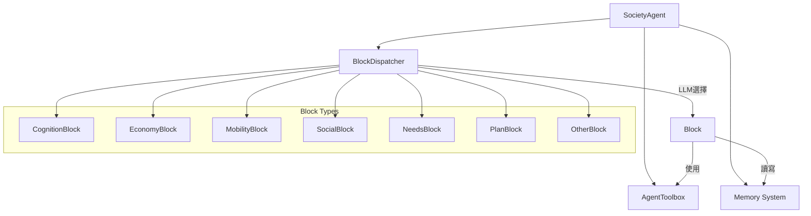

# 如何在 AgentSociety-CP 中新增 Agent Block

## 📋 目錄
1. [系統概述](#系統概述)
2. [現有 Block 清單](#現有-block-清單)
3. [Block 系統架構](#block-系統架構)
4. [新增 Block 完整指南](#新增-block-完整指南)
5. [實例演示](#實例演示)
6. [測試和驗證](#測試和驗證)
7. [最佳實踐](#最佳實踐)

## 系統概述

AgentSociety-CP 使用模組化的 Block 系統來實現代理的各種行為能力。每個 Block 負責處理特定類型的活動，通過 BlockDispatcher 進行智能調度。

### Block 系統的核心特性：
- **模組化設計**: 每個功能獨立封裝
- **自動調度**: LLM 根據代理意圖選擇合適的 Block
- **統一介面**: 所有 Block 遵循相同的 API 規範
- **可擴展性**: 支援自定義 Block 的無縫整合

## 現有 Block 清單

### 🧠 認知系統 (cognition_block.py)
- **CognitionBlock**: 處理態度、思想和情感的日常更新

### 💰 經濟系統 (economy_block.py)
- **WorkBlock**: 處理工作相關的經濟活動和時間追蹤
- **ConsumptionBlock**: 決定消費金額和物品
- **EconomyNoneBlock**: 其他經濟活動的備用處理
- **EconomyBlock**: 協調工作、購物、消費等經濟活動
- **MonthEconomyPlanBlock**: 管理月度經濟規劃

### 🚶 移動系統 (mobility_block.py)
- **PlaceSelectionBlock**: 為未知位置選擇目的地
- **MoveBlock**: 執行位置間的移動操作
- **MobilityNoneBlock**: 處理其他移動操作
- **MobilityBlock**: 管理上班、回家等各種移動行為

### 🎯 需求系統 (needs_block.py)
- **NeedsBlock**: 管理基於馬斯洛需求層次的動態需求系統

### 🔧 其他行為 (other_block.py)
- **SleepBlock**: 處理睡眠相關行為
- **OtherNoneBlock**: 處理除睡眠外的各種行為
- **OtherBlock**: 負責移動、經濟、社交之外的所有行為

### 📅 計劃系統 (plan_block.py)
- **PlanBlock**: 通過 LLM 生成和管理執行計劃

### 👥 社交系統 (social_block.py)
- **SocialNoneBlock**: 處理其他社交情況
- **FindPersonBlock**: 尋找合適的社交對象
- **MessageBlock**: 發送訊息給他人
- **SocialBlock**: 管理各種社交互動活動

**總計**: 7個檔案，19個Block類別

## Block 系統架構

### 核心組件關係圖



### Block 執行流程

1. **代理接收意圖** → SocietyAgent.forward()
2. **調度器選擇** → BlockDispatcher.dispatch()
3. **LLM 決策** → 根據意圖描述選擇最合適的 Block
4. **執行 Block** → 選中的 Block.forward()
5. **更新狀態** → 記憶體和代理狀態更新

## 新增 Block 完整指南

### Step 1: 創建 Block 檔案

在 `packages/agentsociety/agentsociety/cityagent/blocks/` 目錄下創建新檔案：

```python
# 範例：health_block.py
from typing import Any
import json_repair
from pydantic import BaseModel

from ...agent import (
    AgentToolbox,
    Block,
    FormatPrompt,
    DotDict,
)
from ...logger import get_logger
from ...memory import Memory
from ..sharing_params import SocietyAgentBlockOutput

# 定義 Block 專用的輸出格式
class HealthBlockOutput(SocietyAgentBlockOutput):
    health_status: str
    activity_performed: str
    health_improvement: float

# 定義 LLM 提示模板
HEALTH_ACTIVITY_PROMPT = """
作為一個智能代理的健康管理系統，請根據當前情況執行健康活動。

當前意圖: ${context.current_step.intention}
當前情感: ${status.emotion_types}
當前位置: ${context.current_position}
健康狀態: ${status.health_satisfaction}
當前時間: ${context.current_time}

請執行相應的健康活動並估算時間消耗（分鐘）。

可執行的健康活動類型：
- 運動鍛煉（跑步、健身、瑜伽等）
- 休息恢復（冥想、放鬆、小憩等）
- 醫療保健（體檢、就醫、服藥等）
- 養生活動（spa、按摩、營養補充等）

請根據當前狀況選擇最合適的活動。

回應格式：
{
    "activity": "具體的健康活動描述",
    "health_improvement": 0.1,
    "time": 30,
    "success": true,
    "reason": "選擇此活動的原因"
}
"""

class HealthBlock(Block):
    """處理代理的健康相關活動
    
    此 Block 負責管理代理的健康行為，包括：
    - 運動和鍛煉
    - 休息和恢復
    - 醫療保健
    - 養生活動
    """
    
    # 必要的類別屬性
    name = "HealthBlock"
    description = "Handles health-related activities like exercise, rest, medical care, and wellness activities"
    OutputType = HealthBlockOutput
    
    # 定義此 Block 可處理的動作類型（供 LLM 參考）
    actions = {
        "exercise": "進行體育運動或體能鍛煉",
        "rest": "休息、放鬆或恢復性活動", 
        "medical": "就醫、體檢或醫療保健",
        "wellness": "養生、保健或健康促進活動"
    }
    
    def __init__(
        self,
        toolbox: AgentToolbox,
        agent_memory: Memory,
        health_prompt: str = HEALTH_ACTIVITY_PROMPT,
    ):
        """初始化 HealthBlock
        
        Args:
            toolbox: 代理工具箱，包含 LLM、環境等
            agent_memory: 代理記憶體系統
            health_prompt: 健康活動的 LLM 提示模板
        """
        super().__init__(
            toolbox=toolbox,
            agent_memory=agent_memory,
        )
        self.guidance_prompt = FormatPrompt(
            template=health_prompt,
            memory=agent_memory,
        )
    
    async def forward(self, context: DotDict) -> HealthBlockOutput:
        """執行健康相關活動
        
        Args:
            context: 代理上下文，包含當前步驟和計劃信息
            
        Returns:
            HealthBlockOutput: 包含活動結果、時間消耗和健康狀態更新
        """
        try:
            # 格式化提示並呼叫 LLM
            await self.guidance_prompt.format(context=context)
            result = await self.llm.atext_request(
                self.guidance_prompt.to_dialog(),
                response_format={"type": "json_object"}
            )
            
            # 解析 LLM 回應
            result_dict = json_repair.loads(result)
            activity = result_dict.get("activity", "未知健康活動")
            health_improvement = float(result_dict.get("health_improvement", 0.05))
            time_consumed = int(result_dict.get("time", 30))
            success = bool(result_dict.get("success", True))
            reason = result_dict.get("reason", "")
            
            # 更新代理的健康狀態
            current_health = await self.memory.status.get("health_satisfaction", 0.8)
            new_health = min(1.0, current_health + health_improvement)
            await self.memory.status.update("health_satisfaction", new_health)
            
            # 記錄活動到流式記憶
            node_id = await self.memory.stream.add(
                topic="health",
                description=f"執行健康活動: {activity}，健康狀況改善 {health_improvement:.2f}"
            )
            
            # 記錄到健康歷史
            await self.memory.status.update(
                "health_activities",
                [f"執行了 {activity}，耗時 {time_consumed} 分鐘"],
                mode="merge"
            )
            
            get_logger().info(f"HealthBlock 執行成功: {activity}, 耗時: {time_consumed}分鐘")
            
            return HealthBlockOutput(
                success=success,
                evaluation=f"健康活動: {activity}",
                consumed_time=time_consumed,
                node_id=node_id,
                health_status=f"健康度: {new_health:.2f}",
                activity_performed=activity,
                health_improvement=health_improvement
            )
            
        except Exception as e:
            get_logger().warning(f"HealthBlock 執行錯誤: {str(e)}")
            # 提供後備方案
            node_id = await self.memory.stream.add(
                topic="health",
                description="進行了基本的健康活動"
            )
            
            return HealthBlockOutput(
                success=False,
                evaluation="基本健康活動",
                consumed_time=15,
                node_id=node_id,
                health_status="健康狀況維持",
                activity_performed="基本休息",
                health_improvement=0.01
            )
```

### Step 2: 更新 __init__.py

修改 `blocks/__init__.py` 檔案：

```python
from .cognition_block import CognitionBlock
from .economy_block import EconomyBlock
from .mobility_block import MobilityBlock
from .needs_block import NeedsBlock
from .other_block import OtherBlock
from .plan_block import PlanBlock
from .social_block import SocialBlock
from .health_block import HealthBlock  # 新增這行

__all__ = [
    "MobilityBlock",
    "CognitionBlock",
    "PlanBlock",
    "NeedsBlock",
    "SocialBlock",
    "EconomyBlock",
    "OtherBlock",
    "HealthBlock",  # 新增這行
]
```

### Step 3: 更新代理的記憶體配置（可選）

如果需要新的狀態屬性，在 `SocietyAgent` 中添加：

```python
class SocietyAgent(CitizenAgentBase):
    StatusAttributes = [
        # 現有屬性...
        MemoryAttribute(
            name="health_satisfaction",
            type=float,
            default_or_value=0.8,
            description="代理的健康滿意度, 0-1",
        ),
        MemoryAttribute(
            name="health_activities",
            type=list,
            default_or_value=[],
            description="健康活動歷史記錄",
        ),
        # ... 其他屬性
    ]
```

### Step 4: 註冊 Block 到代理

修改 `SocietyAgent` 初始化代碼：

```python
from .blocks import HealthBlock  # 引用新的 Block

class SocietyAgent(CitizenAgentBase):
    def __init__(self, ...):
        super().__init__(...)
        
        # 創建 HealthBlock 實例
        self.health_block = HealthBlock(
            toolbox=self._toolbox,
            agent_memory=self.memory,
        )
        
        # 如果 blocks 是 None，創建新列表
        if blocks is None:
            blocks = []
        
        # 將新 Block 加入到 blocks 列表
        blocks.append(self.health_block)
        
        # 註冊到調度器（這通常在父類中自動處理）
        self.dispatcher.register_blocks([self.health_block])
```

## 實例演示

以下是一個創建學習 Block 的完整實例：

```python
# learning_block.py
from typing import Any
import json_repair
from ...agent import Block, AgentToolbox, FormatPrompt, DotDict
from ...memory import Memory
from ..sharing_params import SocietyAgentBlockOutput

LEARNING_PROMPT = """
作為學習管理系統，請根據代理的學習意圖執行學習活動。

學習意圖: ${context.current_step.intention}
當前情感: ${status.emotion_types}
教育背景: ${status.education}
學習技能: ${status.learning_skills}

請選擇合適的學習活動：
1. 閱讀學習（書籍、文章、資料）
2. 在線課程（網課、教學視頻）
3. 實踐練習（動手操作、實驗）
4. 討論交流（與他人討論、參加研討會）

回應格式：
{
    "learning_activity": "具體學習活動",
    "skill_improvement": 0.05,
    "knowledge_gained": "獲得的知識描述",
    "time": 60,
    "success": true
}
"""

class LearningBlock(Block):
    """處理代理的學習活動"""
    
    name = "LearningBlock"
    description = "Handles learning activities including reading, online courses, practice, and discussions"
    
    def __init__(self, toolbox: AgentToolbox, agent_memory: Memory):
        super().__init__(toolbox=toolbox, agent_memory=agent_memory)
        self.learning_prompt = FormatPrompt(LEARNING_PROMPT, memory=agent_memory)
    
    async def forward(self, context: DotDict):
        """執行學習活動"""
        try:
            await self.learning_prompt.format(context=context)
            result = await self.llm.atext_request(
                self.learning_prompt.to_dialog(),
                response_format={"type": "json_object"}
            )
            
            result_dict = json_repair.loads(result)
            
            # 更新學習技能
            learning_skills = await self.memory.status.get("learning_skills", [])
            new_knowledge = result_dict.get("knowledge_gained", "")
            if new_knowledge:
                learning_skills.append(new_knowledge)
                await self.memory.status.update("learning_skills", learning_skills)
            
            # 記錄學習活動
            node_id = await self.memory.stream.add(
                topic="learning",
                description=f"學習活動: {result_dict.get('learning_activity', '')}"
            )
            
            return {
                "success": result_dict.get("success", True),
                "evaluation": f"學習: {result_dict.get('learning_activity', '')}",
                "consumed_time": result_dict.get("time", 60),
                "node_id": node_id,
            }
            
        except Exception as e:
            # 錯誤處理和後備方案
            node_id = await self.memory.stream.add(
                topic="learning",
                description="進行了基礎學習活動"
            )
            return {
                "success": False,
                "evaluation": "基礎學習",
                "consumed_time": 30,
                "node_id": node_id,
            }
```

## 測試和驗證

### 單元測試範例

```python
# test_health_block.py
import pytest
from unittest.mock import AsyncMock, MagicMock
from health_block import HealthBlock

@pytest.mark.asyncio
async def test_health_block_forward():
    # 模擬依賴
    toolbox = MagicMock()
    toolbox.llm.atext_request = AsyncMock(return_value='{"activity": "跑步30分鐘", "health_improvement": 0.1, "time": 30, "success": true}')
    
    memory = MagicMock()
    memory.status.get = AsyncMock(return_value=0.7)
    memory.status.update = AsyncMock()
    memory.stream.add = AsyncMock(return_value="node_123")
    
    # 創建 Block 實例
    health_block = HealthBlock(toolbox=toolbox, agent_memory=memory)
    
    # 模擬上下文
    context = {
        "current_step": {"intention": "我想要運動健身"},
        "current_position": "在家"
    }
    
    # 執行測試
    result = await health_block.forward(context)
    
    # 驗證結果
    assert result.success == True
    assert result.consumed_time == 30
    assert "跑步" in result.activity_performed
```

### 整合測試

```python
# test_integration.py
async def test_block_integration():
    """測試 Block 在完整代理系統中的整合"""
    
    # 創建代理實例
    agent = SocietyAgent(
        id=1,
        name="測試代理",
        toolbox=toolbox,
        memory=memory,
        blocks=[HealthBlock(toolbox, memory)]
    )
    
    # 模擬代理接收健康相關意圖
    await agent.memory.status.update("current_plan", {
        "steps": [{"intention": "我想要做一些運動來保持健康"}],
        "index": 0
    })
    
    # 執行代理行為
    result = await agent.forward()
    
    # 驗證 Block 被正確調度和執行
    assert result is not None
```

## 最佳實踐

### 🎯 設計原則

1. **單一職責**: 每個 Block 只處理一種類型的活動
2. **清晰描述**: `name` 和 `description` 要讓 LLM 容易理解
3. **錯誤處理**: 提供合理的後備方案
4. **狀態更新**: 適當更新代理的記憶體狀態
5. **日誌記錄**: 記錄重要的執行信息

### 📋 命名規範

- **檔案名**: 使用小寫字母和底線，如 `health_block.py`
- **類別名**: 使用駝峰命名法，如 `HealthBlock`
- **Block name**: 使用清晰的英文描述，如 "HealthBlock"
- **方法名**: 使用小寫字母和底線，如 `update_health_status()`

### ⚡ 性能考量

1. **異步操作**: 所有 I/O 操作使用 `async/await`
2. **記憶體管理**: 避免在 Block 中儲存大量狀態
3. **LLM 調用**: 合理設計提示，避免過於複雜的推理
4. **錯誤處理**: 快速失敗，提供簡單的後備方案

### 🔒 安全考量

1. **輸入驗證**: 驗證 LLM 回應的格式和內容
2. **範圍限制**: 限制 Block 的操作範圍和權限
3. **狀態保護**: 防止不當的狀態修改
4. **日誌安全**: 避免在日誌中記錄敏感信息

### 📚 文檔要求

1. **類別文檔**: 清楚說明 Block 的用途和功能
2. **方法文檔**: 詳細描述參數和返回值
3. **使用範例**: 提供具體的使用範例
4. **錯誤說明**: 說明可能的錯誤情況和處理方式

## 常見問題

### Q: Block 之間可以互相調用嗎？
A: 不建議。Block 應該是獨立的功能模組，通過 BlockDispatcher 進行協調。

### Q: 如何處理複雜的多步驟任務？
A: 複雜任務應該由 PlanBlock 分解為多個簡單步驟，然後由不同的 Block 分別處理。

### Q: Block 可以直接修改其他代理的狀態嗎？
A: 不可以。Block 只能修改自己所屬代理的狀態，代理間的互動通過訊息系統進行。

### Q: 如何調試 Block 的執行過程？
A: 使用 `get_logger()` 記錄關鍵信息，並可以通過代理的記憶體系統查看執行歷史。

### Q: Block 的執行順序如何確定？
A: BlockDispatcher 使用 LLM 根據當前意圖選擇最合適的 Block，不存在固定的執行順序。

---

**版本**: v1.0  
**最後更新**: 2024年  
**維護者**: AgentSociety-CP 開發團隊

如有疑問或需要協助，請參考系統文檔或聯繫開發團隊。