# AgentSociety-CP 代理系統架構圖

## 系統架構圖

```mermaid
graph TB
    %% 代理核心層
    subgraph AgentCore["代理核心層"]
        Agent["Agent<br/>(抽象基類)"]
        CitizenBase["CitizenAgentBase<br/>(市民代理基類)"]
        InstitutionBase["InstitutionAgentBase<br/>(機構代理基類)"]
        SupervisorBase["SupervisorBase<br/>(監督代理)"]
        IndividualBase["IndividualAgentBase<br/>(個體代理)"]
    end
    
    %% 代理實現層
    subgraph AgentImpl["代理實現層"]
        SocietyAgent["SocietyAgent<br/>社會代理"]
        BankAgent["BankAgent<br/>銀行代理"]
        FirmAgent["FirmAgent<br/>公司代理"]
        GovAgent["GovernmentAgent<br/>政府代理"]
    end
    
    %% 工具箱系統
    subgraph ToolboxSys["工具箱系統"]
        Toolbox["AgentToolbox<br/>代理工具箱"]
        CustomTool["CustomTool<br/>自定義工具"]
    end
    
    %% 記憶體系統
    subgraph MemorySys["記憶體系統"]
        Memory["Memory<br/>記憶體管理器"]
        KVMem["KVMemory<br/>狀態記憶"]
        StreamMem["StreamMemory<br/>流式記憶"]
        VectorStore["VectorStore<br/>向量儲存"]
        Embedding["SparseTextEmbedding<br/>稀疏文本嵌入"]
    end
    
    %% 環境系統
    subgraph EnvSys["環境系統"]
        Environment["Environment<br/>環境管理器"]
        CityClient["CityClient<br/>城市模擬客戶端"]
        EconClient["EconomyClient<br/>經濟系統客戶端"]
        MapData["MapData<br/>地圖資料"]
        PersonService["PersonService<br/>人員服務"]
    end
    
    %% LLM系統
    subgraph LLMSys["LLM系統"]
        LLM["LLM<br/>大語言模型管理器"]
        Providers["LLM提供商<br/>OpenAI/Qwen/Deepseek"]
    end
    
    %% 訊息系統
    subgraph MessageSys["訊息系統"]
        Messager["Messager<br/>訊息管理器"]
        Message["Message<br/>訊息物件"]
        MsgInterceptor["MessageInterceptor<br/>訊息攔截器"]
    end
    
    %% 功能區塊系統
    subgraph BlockSys["功能區塊系統"]
        BlockDispatcher["BlockDispatcher<br/>區塊調度器"]
        CognitionBlock["CognitionBlock<br/>認知區塊"]
        SocialBlock["SocialBlock<br/>社交區塊"]
        EconomyBlock["EconomyBlock<br/>經濟區塊"]
        MobilityBlock["MobilityBlock<br/>移動區塊"]
        NeedsBlock["NeedsBlock<br/>需求區塊"]
        PlanBlock["PlanBlock<br/>計劃區塊"]
    end
    
    %% 儲存系統
    subgraph StorageSys["儲存系統"]
        DatabaseWriter["DatabaseWriter<br/>資料庫寫入器"]
        StorageDialog["StorageDialog<br/>對話儲存"]
        StorageSurvey["StorageSurvey<br/>調查儲存"]
    end
    
    %% 繼承關係
    Agent --> CitizenBase
    Agent --> InstitutionBase
    Agent --> SupervisorBase
    Agent --> IndividualBase
    
    CitizenBase --> SocietyAgent
    InstitutionBase --> BankAgent
    InstitutionBase --> FirmAgent
    InstitutionBase --> GovAgent
    
    %% 組合關係 - 代理使用工具箱
    SocietyAgent -.->|使用| Toolbox
    SocietyAgent -.->|擁有| Memory
    
    %% 工具箱整合各系統
    Toolbox --> LLM
    Toolbox --> Environment
    Toolbox --> Messager
    Toolbox --> DatabaseWriter
    Toolbox --> CustomTool
    
    %% 記憶體系統內部
    Memory --> KVMem
    Memory --> StreamMem
    KVMem --> VectorStore
    StreamMem --> VectorStore
    VectorStore --> Embedding
    
    %% 環境系統內部
    Environment --> CityClient
    Environment --> EconClient
    Environment --> MapData
    Environment --> PersonService
    
    %% LLM系統
    LLM --> Providers
    
    %% 訊息系統內部
    Messager --> Message
    Messager --> MsgInterceptor
    
    %% 功能區塊系統
    SocietyAgent -.->|包含| CognitionBlock
    SocietyAgent -.->|包含| NeedsBlock
    SocietyAgent -.->|包含| PlanBlock
    BlockDispatcher -.->|調度| CognitionBlock
    BlockDispatcher -.->|調度| SocialBlock
    BlockDispatcher -.->|調度| EconomyBlock
    BlockDispatcher -.->|調度| MobilityBlock
    BlockDispatcher -.->|調度| NeedsBlock
    BlockDispatcher -.->|調度| PlanBlock
    
    %% 代理與環境互動
    CitizenBase -.->|綁定| CityClient
    CitizenBase -.->|綁定| EconClient
    InstitutionBase -.->|綁定| EconClient
    
    %% 代理與記憶體互動
    SocietyAgent -.->|存取| KVMem
    SocietyAgent -.->|記錄| StreamMem
    
    %% 代理與訊息互動
    SocietyAgent -.->|發送接收| Message
    
    %% 代理與LLM互動
    SocietyAgent -.->|文本生成| LLM
    CognitionBlock -.->|推理| LLM
    
    %% 代理與儲存互動
    SocietyAgent -.->|寫入| DatabaseWriter
    SocietyAgent -.->|儲存| StorageDialog
    SocietyAgent -.->|記錄| StorageSurvey
    
    %% 樣式設定
    classDef agentCore fill:#e3f2fd,stroke:#1976d2,stroke-width:2px
    classDef agentImpl fill:#bbdefb,stroke:#1565c0,stroke-width:2px
    classDef toolbox fill:#f3e5f5,stroke:#7b1fa2,stroke-width:2px
    classDef memory fill:#e8f5e8,stroke:#388e3c,stroke-width:2px
    classDef environment fill:#fff3e0,stroke:#f57c00,stroke-width:2px
    classDef llm fill:#fce4ec,stroke:#c2185b,stroke-width:2px
    classDef message fill:#e0f2f1,stroke:#00796b,stroke-width:2px
    classDef block fill:#f1f8e9,stroke:#689f38,stroke-width:2px
    classDef storage fill:#fafafa,stroke:#616161,stroke-width:2px
    
    class Agent,CitizenBase,InstitutionBase,SupervisorBase,IndividualBase agentCore
    class SocietyAgent,BankAgent,FirmAgent,GovAgent agentImpl
    class Toolbox,CustomTool toolbox
    class Memory,KVMem,StreamMem,VectorStore,Embedding memory
    class Environment,CityClient,EconClient,MapData,PersonService environment
    class LLM,Providers llm
    class Messager,Message,MsgInterceptor message
    class BlockDispatcher,CognitionBlock,SocialBlock,EconomyBlock,MobilityBlock,NeedsBlock,PlanBlock block
    class DatabaseWriter,StorageDialog,StorageSurvey storage
```

## 系統架構層級說明

### 🎯 **代理核心層 (Agent Core Layer)**
- **Agent**: 所有代理的抽象基類，定義通用介面和基本行為
- **CitizenAgentBase**: 市民代理基類，支援城市模擬綁定和環境互動
- **InstitutionAgentBase**: 機構代理基類，支援經濟系統整合
- **SupervisorBase**: 監督代理，用於訊息驗證和干預
- **IndividualBase**: 個體代理，用於獨立任務執行

### 🏘️ **代理實現層 (Agent Implementation Layer)**
- **SocietyAgent**: 完整的社會代理實現，具備：
  - 認知能力：情感更新、思考推理
  - 社交互動：人際交往、關係管理
  - 計劃執行：目標設定、步驟執行
- **BankAgent**: 銀行代理，處理金融服務
- **FirmAgent**: 公司代理，管理企業運營
- **GovernmentAgent**: 政府代理，制定政策和監管

### 🧰 **工具箱系統 (Toolbox System)**
- **AgentToolbox**: 整合所有工具和服務的統一介面
- **CustomTool**: 支援自定義工具擴展

### 💾 **記憶體系統 (Memory System)**
- **Memory**: 記憶體管理器，協調不同類型的記憶
- **KVMemory**: 狀態記憶，儲存個人屬性和即時狀態
- **StreamMemory**: 流式記憶，記錄經驗和活動歷史
- **VectorStore**: 向量儲存，支援語義搜索
- **SparseTextEmbedding**: 稀疏文本嵌入，提供高效的文本表示

### 🏙️ **環境系統 (Environment System)**
- **Environment**: 環境管理器，協調各種模擬服務
- **CityClient**: 城市模擬客戶端，處理交通和位置
- **EconomyClient**: 經濟系統客戶端，管理貨幣和市場
- **MapData**: 地圖資料管理
- **PersonService**: 人員服務，處理代理在模擬器中的表示

### 🤖 **LLM系統 (LLM System)**
- **LLM**: 大語言模型管理器，提供統一的API
- **Providers**: 支援多種LLM提供商（OpenAI、Qwen、Deepseek）

### 📨 **訊息系統 (Message System)**
- **Messager**: 訊息管理器，處理代理間通訊
- **Message**: 訊息物件，定義訊息格式和內容
- **MessageInterceptor**: 訊息攔截器，用於監督和過濾

### 🧩 **功能區塊系統 (Block System)**
- **BlockDispatcher**: 區塊調度器，智能選擇合適的功能區塊
- **功能區塊**：
  - **CognitionBlock**: 認知區塊，處理情感和思考
  - **SocialBlock**: 社交區塊，管理人際互動
  - **EconomyBlock**: 經濟區塊，處理工作和消費
  - **MobilityBlock**: 移動區塊，規劃路徑和更新位置
  - **NeedsBlock**: 需求區塊，評估馬斯洛需求層次
  - **PlanBlock**: 計劃區塊，生成和執行計劃

### 💽 **儲存系統 (Storage System)**
- **DatabaseWriter**: 資料庫寫入器，持久化資料
- **StorageDialog**: 對話儲存，記錄互動歷史
- **StorageSurvey**: 調查儲存，保存問卷回應

## 關鍵設計特點

1. **分層架構**: 清晰的層次劃分，便於維護和擴展
2. **模組化設計**: 功能區塊可插拔，支援自定義擴展
3. **統一介面**: 工具箱提供統一的服務存取點
4. **雙重記憶**: 狀態記憶和流式記憶滿足不同需求
5. **多模型支援**: 靈活整合不同的LLM提供商
6. **實時模擬**: 與城市模擬器深度整合
7. **持久化**: 完整的資料儲存和回放機制

這種架構設計實現了高度模組化、可擴展的多代理城市模擬系統，適用於複雜的社會科學研究和城市規劃應用。